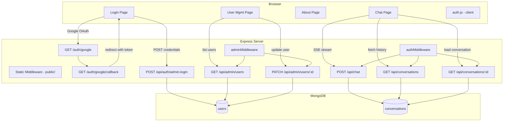
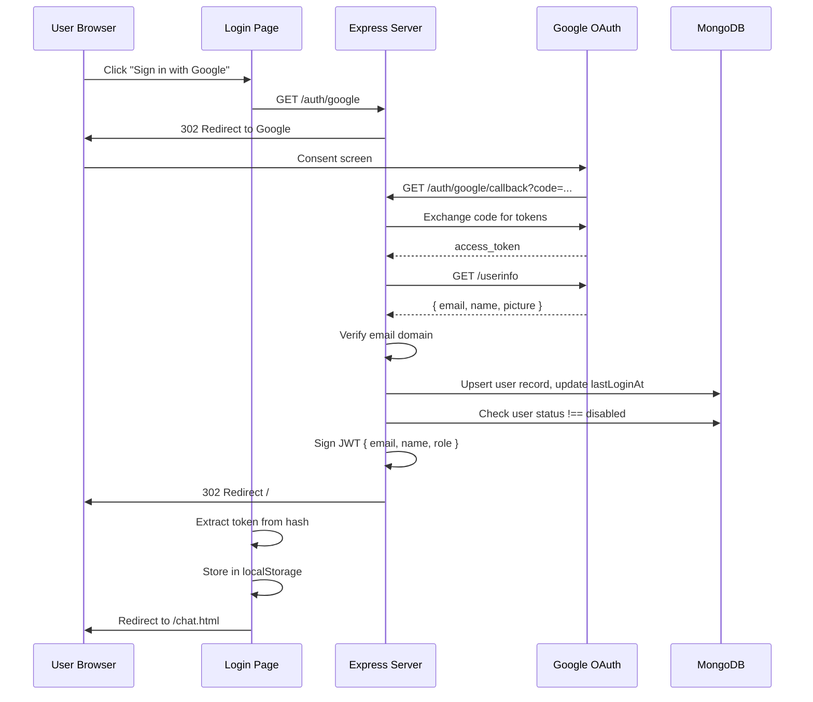
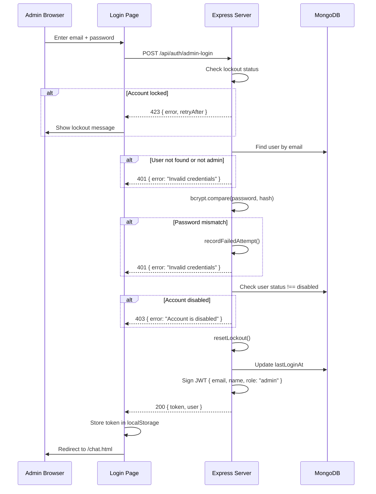
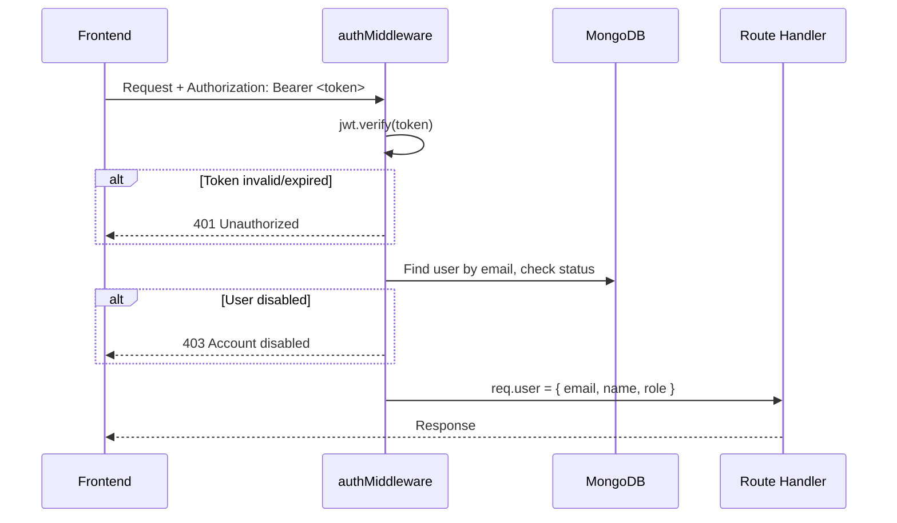

# Design Document: Frontend Auth & Admin

## Overview

This design covers the full frontend application and supporting backend API routes for the TAM Agent. The system adds:

1. **Multi-page frontend** — Login, Chat, About, and User Management pages built with plain HTML/CSS/JS, served statically from `public/`.
2. **Dual authentication** — Google OAuth for regular users (domain-restricted) and password-based login for the super admin (`admin@capillarytech.com`).
3. **Conversation persistence** — MongoDB-backed conversation storage with per-user isolation and a sidebar for history navigation.
4. **Admin user management** — Role/status CRUD for the super admin to control access.

The frontend communicates with the Express backend exclusively via JSON REST APIs and SSE streams. Authentication state is managed client-side using JWT tokens stored in `localStorage`.

## Architecture



### Request Flow

1. Browser loads static HTML/CSS/JS from `public/` via Express static middleware.
2. Client-side `auth.js` checks for a valid JWT in `localStorage` on every protected page load.
3. API requests include `Authorization: Bearer <token>` header.
4. Backend middleware verifies the JWT, checks user status (not disabled), and attaches `req.user`.
5. Admin-only routes additionally verify `req.user.role === 'admin'`.

## Components and Interfaces

### Frontend File Structure

```
public/
├── index.html          # Login page (app entry point)
├── chat.html           # Chat interface (protected)
├── about.html          # About page (public)
├── admin.html          # User management (admin-only)
├── css/
│   └── styles.css      # Shared design system
├── js/
│   ├── auth.js         # Token management, guards, login/logout
│   ├── chat.js         # Chat UI, SSE streaming, conversation loading
│   ├── admin.js        # User management table, actions
│   ├── nav.js          # Shared navigation bar rendering
│   └── api.js          # Fetch wrapper with auth headers
```

### Component: Login Page (`index.html`)

**Responsibilities:**
- Display Google OAuth button and admin login form
- Handle OAuth callback token extraction from URL hash
- Handle admin login form submission
- Display error messages (invalid credentials, lockout, disabled account)
- Redirect to Chat page on successful auth

**Interface:**
```
Inputs: URL hash (#token=..., #error=...), form fields (email, password)
Outputs: localStorage.setItem('token', jwt), window.location = '/chat.html'
```

### Component: Chat Page (`chat.html`)

**Responsibilities:**
- Enforce authentication (redirect if no valid token)
- Render conversation sidebar with history
- Handle message composition and submission
- Stream SSE responses and render tokens in real-time
- Create new conversations, load existing ones

**Interface:**
```
API calls: GET /api/conversations, GET /api/conversations/:id, POST /api/chat
Events: SSE token, status, phase, complete, error
State: currentConversationId, messages[]
```

### Component: About Page (`about.html`)

**Responsibilities:**
- Display application description (public, no auth required)
- Show navigation appropriate to auth state (login link vs full nav)

### Component: User Management Page (`admin.html`)

**Responsibilities:**
- Enforce authentication + admin role
- Display user table with name, email, role, status, lastLoginAt
- Provide enable/disable and promote/demote actions
- Prevent self-modification of super admin account

**Interface:**
```
API calls: GET /api/admin/users, PATCH /api/admin/users/:id
```

### Component: Client Auth Module (`js/auth.js`)

**Responsibilities:**
- Store/retrieve/clear JWT from localStorage
- Decode JWT payload (without verification — server verifies)
- Page guard: redirect to login if token missing or expired
- Admin guard: redirect to chat if user is not admin
- Provide `getCurrentUser()` helper returning decoded payload

**Interface:**
```javascript
// Public API
getToken() → string | null
setToken(token) → void
clearToken() → void
getCurrentUser() → { email, name, role, exp } | null
isAuthenticated() → boolean
isAdmin() → boolean
requireAuth() → void  // redirects if not authenticated
requireAdmin() → void // redirects if not admin
```

### Component: API Wrapper (`js/api.js`)

**Responsibilities:**
- Wrap `fetch()` with Authorization header injection
- Handle 401 responses globally (clear token, redirect to login)
- Handle 403 responses (show disabled account message or redirect)

**Interface:**
```javascript
apiGet(url) → Promise<Response>
apiPost(url, body) → Promise<Response>
apiPatch(url, body) → Promise<Response>
```

### Component: Navigation (`js/nav.js`)

**Responsibilities:**
- Render navigation bar into a `<nav id="navbar">` placeholder
- Conditionally show admin link based on role
- Show user name/email and logout action
- Adapt for authenticated vs unauthenticated state

### Backend: Admin Login Route

**File:** `src/server.js` (new route) or `src/adminAuth.js` (new module)

```javascript
// POST /api/auth/admin-login
// Body: { email, password }
// Returns: { token } or error
```

### Backend: Conversations Routes

**File:** `src/conversations.js` (new module)

```javascript
// GET /api/conversations — list user's conversations
// GET /api/conversations/:id — get single conversation with messages
```

### Backend: Admin Users Routes

**File:** `src/adminRoutes.js` (new module)

```javascript
// GET /api/admin/users — list all users (admin only)
// PATCH /api/admin/users/:id — update role/status (admin only)
```

### Backend: Admin Middleware

**File:** `src/auth.js` (extended)

```javascript
// adminMiddleware — verifies req.user.role === 'admin'
// Enhanced authMiddleware — checks user status !== 'disabled'
```

## API Endpoint Specifications

### POST `/api/auth/admin-login`

**Auth:** None (public)

| Field | Type | Description |
|-------|------|-------------|
| email | string | Admin email address |
| password | string | Plain text password |

**Success Response (200):**
```json
{
  "token": "eyJhbG...",
  "user": { "email": "admin@capillarytech.com", "name": "Admin", "role": "admin" }
}
```

**Error Responses:**
- `401` — Invalid credentials: `{ "error": "Invalid credentials" }`
- `423` — Account locked: `{ "error": "Account locked", "retryAfter": 900 }`
- `403` — Account disabled: `{ "error": "Account is disabled" }`

---

### GET `/api/conversations`

**Auth:** Bearer token required

**Success Response (200):**
```json
[
  {
    "_id": "conv_abc123",
    "title": "Help with API integration",
    "updatedAt": "2024-01-15T10:30:00Z",
    "createdAt": "2024-01-15T09:00:00Z"
  }
]
```

Returns conversations for the authenticated user, sorted by `updatedAt` descending. Messages array is excluded from list response for performance.

---

### GET `/api/conversations/:id`

**Auth:** Bearer token required

**Success Response (200):**
```json
{
  "_id": "conv_abc123",
  "userId": "user@example.com",
  "title": "Help with API integration",
  "messages": [
    { "role": "user", "content": "How do I integrate the API?", "timestamp": "2024-01-15T09:00:00Z" },
    { "role": "assistant", "content": "Here's how...", "timestamp": "2024-01-15T09:00:05Z" }
  ],
  "createdAt": "2024-01-15T09:00:00Z",
  "updatedAt": "2024-01-15T10:30:00Z"
}
```

**Error Responses:**
- `403` — Conversation belongs to another user
- `404` — Conversation not found

---

### GET `/api/admin/users`

**Auth:** Bearer token required + admin role

**Success Response (200):**
```json
[
  {
    "_id": "user_xyz",
    "name": "John Doe",
    "email": "john@capillarytech.com",
    "role": "user",
    "status": "active",
    "lastLoginAt": "2024-01-15T08:00:00Z",
    "createdAt": "2024-01-01T00:00:00Z"
  }
]
```

**Error Responses:**
- `403` — Non-admin user

---

### PATCH `/api/admin/users/:id`

**Auth:** Bearer token required + admin role

**Request Body:**
```json
{ "status": "disabled" }
// or
{ "role": "admin" }
```

**Success Response (200):**
```json
{ "message": "User updated", "user": { "_id": "...", "role": "admin", "status": "active" } }
```

**Error Responses:**
- `400` — Attempting to modify super admin's own account
- `403` — Non-admin user
- `404` — User not found

---

### POST `/api/chat` (existing, enhanced)

**Auth:** Bearer token required

Enhanced to:
1. Create a new conversation document if `conversationId` is null
2. Append messages to existing conversation on completion
3. Auto-generate title from first user message (first 50 chars)

## Data Models

### `users` Collection

```javascript
{
  _id: ObjectId,              // MongoDB auto-generated
  email: "user@domain.com",   // Unique index
  name: "Display Name",       // From Google profile or "Admin"
  picture: "https://...",     // Google profile picture URL (optional)
  role: "user" | "admin",    // Default: "user"
  status: "active" | "disabled", // Default: "active"
  passwordHash: "$2b$...",   // Only for admin (bcrypt hash)
  authProvider: "google" | "password", // How user authenticates
  lastLoginAt: ISODate,      // Updated on each successful login
  createdAt: ISODate,        // Set on first login/creation
  updatedAt: ISODate         // Updated on any modification
}
```

**Indexes:**
- `{ email: 1 }` — unique
- `{ role: 1, status: 1 }` — for admin queries

### `conversations` Collection

```javascript
{
  _id: ObjectId,              // MongoDB auto-generated
  userId: "user@domain.com",  // Owner's email (matches JWT email claim)
  title: "First message preview...", // Auto-generated from first message
  messages: [
    {
      role: "user" | "assistant",
      content: "Message text...",
      timestamp: ISODate
    }
  ],
  createdAt: ISODate,         // When conversation started
  updatedAt: ISODate          // Last message timestamp
}
```

**Indexes:**
- `{ userId: 1, updatedAt: -1 }` — for listing user's conversations sorted by recency

## Authentication Flows

### Google OAuth Flow



### Admin Password Flow



### Token Verification (Protected Routes)



## CSS Design System

### Color Palette

```css
:root {
  /* Primary */
  --color-primary: #2563eb;        /* Blue - buttons, links */
  --color-primary-hover: #1d4ed8;  /* Darker blue - hover states */
  
  /* Neutrals */
  --color-bg: #f9fafb;            /* Page background */
  --color-surface: #ffffff;        /* Cards, panels */
  --color-border: #e5e7eb;        /* Borders, dividers */
  --color-text: #111827;          /* Primary text */
  --color-text-secondary: #6b7280; /* Secondary text */
  --color-text-muted: #9ca3af;    /* Muted text, timestamps */
  
  /* Sidebar */
  --color-sidebar-bg: #1f2937;    /* Dark sidebar */
  --color-sidebar-text: #f3f4f6;  /* Sidebar text */
  --color-sidebar-hover: #374151; /* Sidebar item hover */
  --color-sidebar-active: #4b5563; /* Active conversation */
  
  /* Status */
  --color-success: #10b981;       /* Active status */
  --color-danger: #ef4444;        /* Errors, disable */
  --color-warning: #f59e0b;       /* Warnings, lockout */
  
  /* Chat */
  --color-user-msg: #2563eb;      /* User message bubble */
  --color-assistant-msg: #ffffff; /* Assistant message bubble */
  
  /* Spacing */
  --space-xs: 0.25rem;
  --space-sm: 0.5rem;
  --space-md: 1rem;
  --space-lg: 1.5rem;
  --space-xl: 2rem;
  
  /* Border radius */
  --radius-sm: 0.375rem;
  --radius-md: 0.5rem;
  --radius-lg: 0.75rem;
  --radius-full: 9999px;
  
  /* Typography */
  --font-sans: -apple-system, BlinkMacSystemFont, 'Segoe UI', Roboto, 'Helvetica Neue', sans-serif;
  --font-mono: 'SF Mono', 'Fira Code', 'Fira Mono', Menlo, monospace;
  --text-xs: 0.75rem;
  --text-sm: 0.875rem;
  --text-base: 1rem;
  --text-lg: 1.125rem;
  --text-xl: 1.25rem;
  --text-2xl: 1.5rem;
}
```

### Layout Patterns

- **Chat layout:** CSS Grid with sidebar (280px) + main content (1fr)
- **Responsive breakpoint:** 768px — sidebar collapses to overlay
- **Card pattern:** `background: var(--color-surface); border: 1px solid var(--color-border); border-radius: var(--radius-lg); padding: var(--space-lg);`
- **Max content width:** 800px for message area (centered)
- **Full-height layout:** `height: 100vh; display: grid; grid-template-rows: auto 1fr;`

### Typography Scale

- Page headings: `var(--text-2xl)`, weight 600
- Section headings: `var(--text-lg)`, weight 600
- Body text: `var(--text-base)`, weight 400
- Small/meta text: `var(--text-sm)`, weight 400
- Timestamps: `var(--text-xs)`, color `var(--color-text-muted)`


## Correctness Properties

*A property is a characteristic or behavior that should hold true across all valid executions of a system — essentially, a formal statement about what the system should do. Properties serve as the bridge between human-readable specifications and machine-verifiable correctness guarantees.*

### Property 1: URL hash token extraction round-trip

*For any* valid JWT string placed in the URL hash as `#token=<jwt>`, the client auth module's extraction function SHALL return the exact same JWT string, and for any error string placed as `#error=<msg>`, the extraction function SHALL return the exact error message.

**Validates: Requirements 1.2, 1.4**

### Property 2: Valid admin credentials produce a JWT with correct role

*For any* valid password that matches the bcrypt hash stored for the admin user, a POST to `/api/auth/admin-login` with the correct email and that password SHALL return a 200 response containing a JWT whose decoded payload includes `role: "admin"` and the admin's email.

**Validates: Requirements 2.2, 14.1, 14.4**

### Property 3: Invalid credentials are always rejected

*For any* email/password combination where either the email does not belong to an admin user or the password does not match the stored bcrypt hash, a POST to `/api/auth/admin-login` SHALL return a 401 status with a generic "Invalid credentials" message.

**Validates: Requirements 2.3, 14.2, 14.3**

### Property 4: Auth guard blocks all invalid tokens

*For any* token state that is missing, malformed, or expired, the client-side auth guard SHALL redirect the user to the Login Page and clear any stored token from localStorage.

**Validates: Requirements 3.1, 3.2, 3.4**

### Property 5: Conversation ownership isolation

*For any* authenticated user, GET `/api/conversations` SHALL return only conversations where `userId` matches the authenticated user's email, and GET `/api/conversations/:id` SHALL return 403 for any conversation where `userId` does not match the authenticated user's email.

**Validates: Requirements 9.1, 9.2, 9.3**

### Property 6: User status enable/disable round-trip

*For any* user record, disabling an active user and then enabling them SHALL restore the user's status to "active", and the intermediate disabled state SHALL block that user's authentication attempts.

**Validates: Requirements 11.2, 11.3**

### Property 7: User role promote/demote round-trip

*For any* user record with role "user", promoting to "admin" and then demoting back SHALL restore the role to "user", and the intermediate admin state SHALL grant access to admin endpoints.

**Validates: Requirements 11.4, 11.5**

### Property 8: Disabled users are blocked on all access paths

*For any* user with status "disabled", authentication via Google OAuth SHALL be rejected, authentication via admin password login SHALL be rejected, and presenting a valid JWT for that user to any protected endpoint SHALL return 403.

**Validates: Requirements 12.1, 12.2, 12.3**

### Property 9: Conversation message persistence preserves structure

*For any* sequence of user and assistant messages appended to a conversation, retrieving that conversation SHALL return all messages in order, each containing a `role` field ("user" or "assistant"), a `content` field matching the original text, and a `timestamp` field.

**Validates: Requirements 7.1, 7.2, 7.3**

### Property 10: Conversation list is sorted by updatedAt descending

*For any* set of conversations belonging to a user with distinct `updatedAt` timestamps, GET `/api/conversations` SHALL return them in strictly descending `updatedAt` order.

**Validates: Requirements 8.1, 9.1**

### Property 11: Navigation renders correctly based on user role

*For any* authenticated user, the navigation bar SHALL display the user's name or email, and SHALL display the User Management link if and only if the user's role is "admin".

**Validates: Requirements 5.2, 5.4**

### Property 12: Admin endpoint role-based access control

*For any* user with role "user", requests to `/api/admin/users` and `/api/admin/users/:id` SHALL return 403, and for any user with role "admin", the same endpoints SHALL return successful responses.

**Validates: Requirements 13.1, 13.3**

### Property 13: SSE token streaming appends all tokens

*For any* sequence of SSE `token` events emitted by the server, the chat UI message area SHALL contain the concatenation of all token payloads in the order they were received.

**Validates: Requirements 6.3**

## Error Handling

### Backend Error Strategy

| Scenario | HTTP Status | Response Body | Client Behavior |
|----------|-------------|---------------|-----------------|
| Missing/invalid JWT | 401 | `{ "error": "Authentication required" }` | Clear token, redirect to login |
| Expired JWT | 401 | `{ "error": "Invalid or expired token" }` | Clear token, redirect to login |
| Disabled user token | 403 | `{ "error": "Account is disabled" }` | Clear token, show disabled message, redirect |
| Non-admin on admin route | 403 | `{ "error": "Admin access required" }` | Redirect to chat |
| Invalid login credentials | 401 | `{ "error": "Invalid credentials" }` | Show error on login form |
| Account locked | 423 | `{ "error": "Account locked", "retryAfter": <seconds> }` | Show lockout countdown |
| Conversation not found | 404 | `{ "error": "Conversation not found" }` | Remove from sidebar, show message |
| Conversation not owned | 403 | `{ "error": "Access denied" }` | Remove from sidebar |
| Self-modification attempt | 400 | `{ "error": "Cannot modify your own account" }` | Show warning toast |
| Server error | 500 | `{ "error": "Internal server error" }` | Show generic error message |
| SSE stream error | SSE event | `event: error\ndata: { "error": "..." }` | Display error, re-enable input |

### Frontend Error Handling Patterns

1. **Global 401 interceptor** — The `api.js` wrapper catches all 401 responses, clears the token, and redirects to login. This handles token expiry transparently.

2. **Form validation** — Client-side validation before submission (non-empty fields, email format). Server errors are displayed inline below the form.

3. **Network errors** — `fetch()` failures (offline, timeout) display a "Connection error. Please try again." toast notification.

4. **SSE error recovery** — If the SSE stream errors or disconnects, the UI re-enables the input and shows the error. The user can retry by sending the message again.

5. **Optimistic UI with rollback** — Admin actions (enable/disable/promote/demote) update the UI immediately, then revert if the API call fails.

### Error Display Components

- **Toast notifications** — Temporary messages (3s) for transient errors (network, server errors)
- **Inline form errors** — Persistent messages below form fields for validation/auth errors
- **Banner alerts** — Full-width alerts for account status issues (disabled, locked)
- **Empty states** — Friendly messages when no conversations exist or no users match filters

## Testing Strategy

### Property-Based Tests (fast-check)

The project already uses `fast-check` (v3.22.0) with `vitest`. Property tests will validate the correctness properties defined above.

**Configuration:**
- Minimum 100 iterations per property test
- Each test tagged with: `Feature: frontend-auth-admin, Property {N}: {title}`
- Tests target backend logic (auth, conversations, admin routes) where input variation matters

**Property test files:**
- `src/__tests__/adminLogin.property.test.js` — Properties 2, 3 (credential validation)
- `src/__tests__/conversations.property.test.js` — Properties 5, 9, 10 (ownership, persistence, sorting)
- `src/__tests__/userManagement.property.test.js` — Properties 6, 7, 8, 12 (role/status management)
- `src/__tests__/authGuard.property.test.js` — Property 4 (token validation)

### Unit Tests (vitest)

Example-based tests for specific scenarios:

- Login page renders correctly with both auth options
- OAuth callback handles success and error cases
- Lockout triggers after 5 failed attempts (Requirement 2.4)
- Super admin cannot self-modify (Requirement 11.6, 13.4)
- About page accessible without auth (Requirement 3.3, 16.1)
- New conversation button clears chat (Requirement 8.5)
- Sidebar toggle works on mobile viewport (Requirement 15.2)

### Integration Tests

- Full OAuth flow (mocked Google endpoints)
- Admin login → chat → create conversation → reload → see in sidebar
- Admin login → user management → disable user → verify user blocked
- SSE streaming end-to-end with mock LLM

### Accessibility Testing

- Automated: axe-core audit on each page
- Manual: keyboard navigation, screen reader testing
- Contrast ratio verification against 4.5:1 minimum
