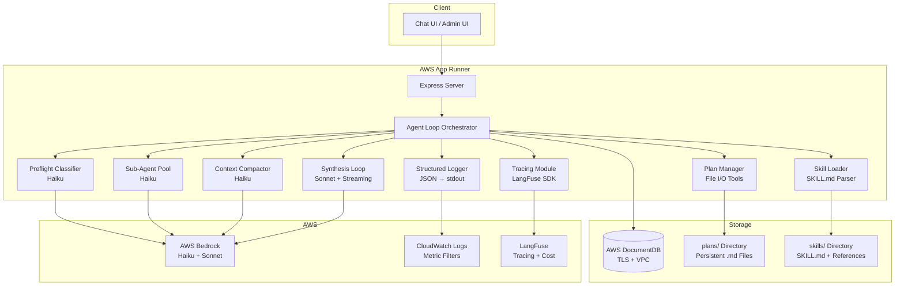
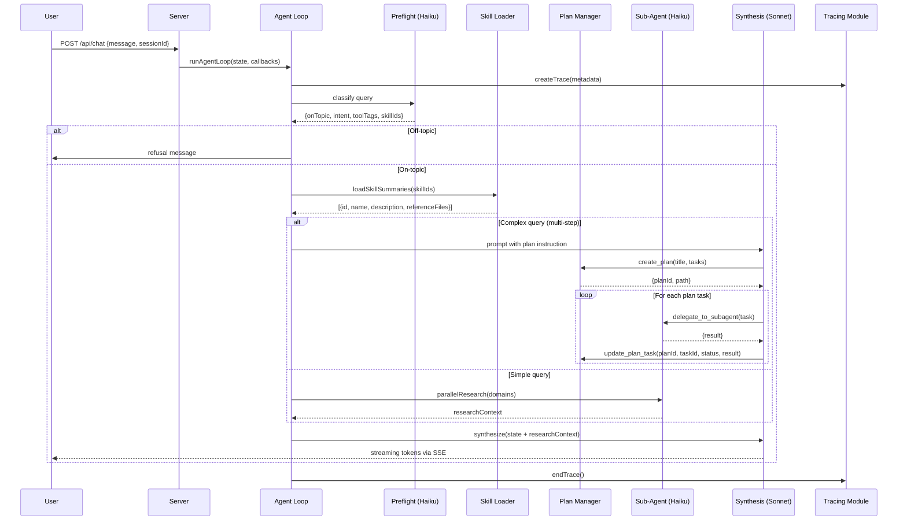
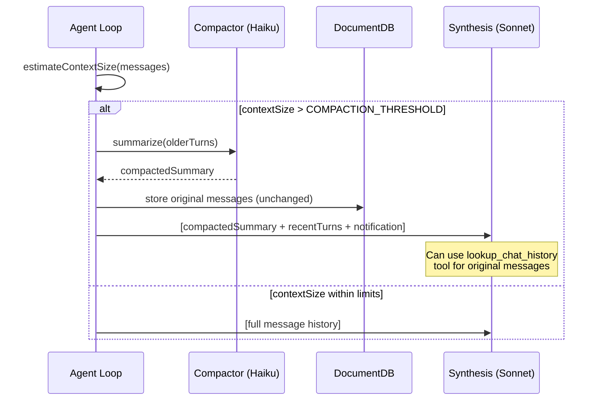

# Design Document: Skill System Enhancement

## Overview

This design transforms the TAM Agent from an eager-loading, single-context architecture to a lazy-loading, plan-driven, multi-model orchestration system. The core principle is **"inform about existence, load on demand"** — the LLM receives minimal metadata about available artifacts (skills, plans, references, chat history) and uses dedicated tools to pull in detail only when needed.

Key architectural changes:
1. **SKILL.md-only discovery** — replaces `skill.json`/`prompt.md` with standardized YAML-frontmatter markdown
2. **Summary-only activation** — skills load only their frontmatter description into context initially
3. **Tool-based reference loading** — the LLM pulls skill reference files via `load_skill_reference`
4. **Plan-first execution** — complex queries produce persistent `.md` plan files managed via tools
5. **Sub-agent delegation** — Haiku-powered sub-agents handle bulk research work
6. **Context compaction** — Haiku summarizes old turns when context nears capacity; originals preserved on disk
7. **DocumentDB migration** — TLS-secured MongoDB-compatible connection within AWS VPC
8. **Infrastructure toggle** — CLI/API to start/stop App Runner + DocumentDB for cost control
9. **Full observability** — LangFuse tracing, structured JSON logs, per-client cost attribution

The system uses a two-model strategy: **Haiku** for cheap operations (preflight classification, sub-agents, compaction) and **Sonnet** exclusively for final synthesis.

## Architecture

### High-Level System Diagram



### Request Flow Sequence



### Context Compaction Flow



## Components and Interfaces

### 1. Skill Loader (`src/skillLoader.js` — rewrite)

**Responsibility:** Discover skills via SKILL.md files, parse YAML frontmatter, expose summaries and reference file manifests.

```javascript
// Public API
export function discoverSkills(): SkillManifest[]
export function getSkillSummary(skillId: string): SkillSummary
export function getSkillReferences(skillId: string): ReferenceFileInfo[]
export function loadReferenceFile(skillId: string, fileName: string): string
export function getRegistryTriggers(): Map<string, string[]>
```

**Internal logic:**
- Scans `skills/` directory for subdirectories containing `SKILL.md`
- Parses YAML frontmatter using a lightweight parser (e.g., split on `---` delimiters + key-value extraction)
- Skips directories without `SKILL.md`, logs warning
- Merges trigger keywords from `skills/registry.json`
- Caches parsed skill manifests at startup (invalidated on restart)
- Reference file discovery: scans skill directory for `.md` files (excluding `SKILL.md` itself) and `references/` subdirectory

### 2. Tool: `load_skill_reference` (new in `src/tools/skillReference.js`)

```javascript
{
  name: "load_skill_reference",
  description: "Load the full content of a reference file from an active skill. Use when you need detailed guidance from a skill's reference materials.",
  inputSchema: {
    type: "object",
    properties: {
      skillId: { type: "string", description: "The skill ID (e.g., 'brd', 'excalidraw-diagram')" },
      fileName: { type: "string", description: "The reference file name (e.g., 'color-palette.md', 'guardrails.md')" }
    },
    required: ["skillId", "fileName"]
  },
  tags: ["skill"]
}
```

**Security:** Resolves path using `path.resolve()` then verifies the resolved path starts with the skill's directory absolute path. Rejects any path containing `..` segments.

### 3. Tool: `list_skill_references` (new in `src/tools/skillReference.js`)

```javascript
{
  name: "list_skill_references",
  description: "List available reference files for a skill. Use to discover what detailed guidance is available before loading specific files.",
  inputSchema: {
    type: "object",
    properties: {
      skillId: { type: "string", description: "The skill ID" }
    },
    required: ["skillId"]
  },
  tags: ["skill"]
}
```

### 4. Plan Manager (`src/planManager.js` — new module)

**Responsibility:** CRUD operations on plan `.md` files in the `plans/` directory.

```javascript
export function createPlan(title: string, tasks: PlanTask[]): PlanFile
export function updatePlanTask(planId: string, taskId: string, status: TaskStatus, result?: string): PlanFile
export function readPlan(planId: string): PlanFile
export function listSessionPlans(sessionId: string): PlanSummary[]
```

**Plan file naming:** `plans/{sessionId}_{timestamp}.md`

**Plan file format:**
```markdown
# Plan: {title}
<!-- planId: {planId} | sessionId: {sessionId} | created: {ISO timestamp} -->

## Tasks

- [ ] **1** | {description} | status: pending
- [x] **2** | {description} | status: complete | result: {result text}
- [ ] **3** | {description} | status: failed | result: {error text}
```

### 5. Plan Tools (registered in `src/tools/planTools.js`)

**`create_plan`:**
```javascript
{
  name: "create_plan",
  description: "Create a structured execution plan with tasks. Use for complex queries requiring multiple steps.",
  inputSchema: {
    type: "object",
    properties: {
      title: { type: "string", description: "Plan title describing the goal" },
      tasks: {
        type: "array",
        items: {
          type: "object",
          properties: {
            id: { type: "string" },
            description: { type: "string" },
            critical: { type: "boolean", description: "If true, plan halts on failure" }
          },
          required: ["id", "description"]
        },
        maxItems: 15
      }
    },
    required: ["title", "tasks"]
  },
  tags: ["plan"]
}
```

**`update_plan_task`:**
```javascript
{
  name: "update_plan_task",
  description: "Update a task's status and result in an existing plan.",
  inputSchema: {
    type: "object",
    properties: {
      planId: { type: "string" },
      taskId: { type: "string" },
      status: { type: "string", enum: ["in_progress", "complete", "failed"] },
      result: { type: "string", description: "Output or error from the task" }
    },
    required: ["planId", "taskId", "status"]
  },
  tags: ["plan"]
}
```

**`read_plan`:**
```javascript
{
  name: "read_plan",
  description: "Read the current state of an execution plan including all task statuses and results.",
  inputSchema: {
    type: "object",
    properties: {
      planId: { type: "string" }
    },
    required: ["planId"]
  },
  tags: ["plan"]
}
```

### 6. Sub-Agent Delegation Tool (`src/tools/subAgent.js` — refactored)

```javascript
{
  name: "delegate_to_subagent",
  description: "Delegate a research or execution task to a sub-agent. The sub-agent uses a cheaper model and has access to all tools.",
  inputSchema: {
    type: "object",
    properties: {
      taskDescription: { type: "string", description: "What the sub-agent should accomplish" },
      context: { type: "string", description: "Additional context to provide the sub-agent" },
      maxTurns: { type: "integer", description: "Max tool-calling turns (default 5, max 10)", minimum: 1, maximum: 10 }
    },
    required: ["taskDescription"]
  },
  tags: ["agent"]
}
```

The sub-agent executes using `createMessage` with `model: 'haiku'`, multi-turn tool loop (same pattern as existing `runSubAgent` in `agentLoop.js`), and returns final text as the tool result.

### 7. Context Compaction (`src/compaction.js` — new module)

```javascript
export function estimateTokenCount(messages: Message[]): number
export function shouldCompact(messages: Message[], threshold: number): boolean
export async function compactHistory(messages: Message[], preserveTurns: number): CompactedResult
export function buildCompactedContext(compactedSummary: string, recentMessages: Message[]): Message[]
```

**Token estimation:** Uses a character-based heuristic (4 chars ≈ 1 token) for fast estimation without requiring a tokenizer library.

### 8. Chat History Tools (`src/tools/chatHistory.js` — new)

**`lookup_chat_history`:**
```javascript
{
  name: "lookup_chat_history",
  description: "Look up original uncompacted messages from the session history. Use when you need verbatim details from earlier in the conversation.",
  inputSchema: {
    type: "object",
    properties: {
      sessionId: { type: "string" },
      startTurn: { type: "integer", description: "Starting turn number (inclusive)" },
      endTurn: { type: "integer", description: "Ending turn number (inclusive)" },
      searchTerm: { type: "string", description: "Search for messages containing this text" }
    },
    required: ["sessionId"]
  },
  tags: ["history"]
}
```

**`get_session_summary`:**
```javascript
{
  name: "get_session_summary",
  description: "Get metadata about the current session including turn count, compaction history, and context utilization.",
  inputSchema: {
    type: "object",
    properties: {
      sessionId: { type: "string" }
    },
    required: ["sessionId"]
  },
  tags: ["history"]
}
```

### 9. Database Module (`src/db.js` — modified)

Updated to support DocumentDB with TLS:
- Reads `STORE_BACKEND` env var (`"documentdb"` or deprecated `"mongodb"`)
- Builds connection URI from `DOCDB_URI` or `DOCDB_CLUSTER_ENDPOINT` + credentials
- Configures TLS using `DOCDB_TLS_CA_FILE` (defaults to `./global-bundle.pem`)
- Sets `retryWrites: false` (DocumentDB limitation)
- Validates CA file existence at connect time

### 10. Infrastructure Toggle (`scripts/infra-toggle.js` — new)

CLI script and admin endpoint for start/stop operations:
- Uses `@aws-sdk/client-apprunner` (`PauseServiceCommand`, `ResumeServiceCommand`)
- Uses `@aws-sdk/client-docdb` (`StopDBClusterCommand`, `StartDBClusterCommand`)
- Ordered operations: stop = pause App Runner → stop DocDB; start = start DocDB → resume App Runner
- Health check polling after start (120s timeout)

### 11. Tracing Module (`src/tracing.js` — new)

```javascript
export function initTracing(): void
export function createTrace(metadata: TraceMetadata): Trace
export function startSpan(trace: Trace, name: string, input: any): Span
export function endSpan(span: Span, output: any): void
export function startGeneration(trace: Trace, params: GenerationParams): Generation
export function endGeneration(generation: Generation, output: any, usage: TokenUsage): void
export function flushTracing(): Promise<void>
```

Operates in no-op mode when LangFuse env vars are not configured.

### 12. Structured Logger (`src/logger.js` — new)

```javascript
export function logLLMCall(params: LLMCallLogEntry): void
export function logRequestComplete(params: RequestCompleteLogEntry): void
export function logEvent(level: string, event: string, data: object): void
```

All output is JSON-serialized to stdout for CloudWatch ingestion.

## Data Models

### SkillManifest

```typescript
interface SkillManifest {
  id: string;               // Directory name (e.g., "brd", "excalidraw-diagram")
  name: string;             // From YAML frontmatter `name` field
  description: string;      // From YAML frontmatter `description` field
  path: string;             // Absolute path to skill directory
  triggers: string[];       // From registry.json
  alwaysLoad: boolean;      // From registry.json (default: false)
  referenceFiles: ReferenceFileInfo[];
}

interface ReferenceFileInfo {
  fileName: string;         // e.g., "color-palette.md"
  relativePath: string;     // e.g., "references/color-palette.md"
}

interface SkillSummary {
  id: string;
  name: string;
  description: string;
  referenceFiles: string[]; // File names only, for informing the LLM
}
```

### PlanFile

```typescript
interface PlanFile {
  planId: string;           // "{sessionId}_{timestamp}" format
  sessionId: string;
  title: string;
  createdAt: string;        // ISO 8601
  tasks: PlanTask[];
}

interface PlanTask {
  id: string;
  description: string;
  critical: boolean;
  status: "pending" | "in_progress" | "complete" | "failed";
  result?: string;
}

type PlanSummary = Pick<PlanFile, 'planId' | 'title' | 'createdAt'> & {
  taskCount: number;
  completedCount: number;
};
```

### Session State

```typescript
interface SessionState {
  sessionId: string;
  userId: string;
  clientTag: string | null;
  messages: Message[];                // Full uncompacted history (stored in DB)
  compactedHistory: string | null;    // Haiku-generated summary
  compactionEvents: CompactionEvent[];
  turnCount: number;
  createdAt: Date;
  updatedAt: Date;
}

interface CompactionEvent {
  timestamp: string;
  turnRangeStart: number;
  turnRangeEnd: number;
  tokensBefore: number;
  tokensAfter: number;
}

interface Message {
  role: "user" | "assistant";
  content: string | ContentBlock[];
  turnNumber: number;
  timestamp: string;
}
```

### Tracing Models

```typescript
interface TraceMetadata {
  requestId: string;
  userId: string;
  sessionId: string;
  clientTag: string;
  queryText: string;
}

interface GenerationParams {
  model: string;           // "haiku" or "sonnet"
  inputMessages: any[];
  modelId: string;         // Resolved Bedrock model ID
}

interface TokenUsage {
  input_tokens: number;
  output_tokens: number;
}

interface LLMCallLogEntry {
  timestamp: string;
  level: "info";
  event: "llm_call";
  model: string;
  input_tokens: number;
  output_tokens: number;
  latency_ms: number;
  client_tag: string;
  session_id: string;
  request_id: string;
}

interface RequestCompleteLogEntry {
  timestamp: string;
  level: "info";
  event: "request_complete";
  total_latency_ms: number;
  total_input_tokens: number;
  total_output_tokens: number;
  llm_call_count: number;
  client_tag: string;
  session_id: string;
  request_id: string;
}
```

### Environment Variables

| Variable | Description | Default |
|----------|-------------|---------|
| `STORE_BACKEND` | Storage backend: `"json"`, `"documentdb"` | `"json"` |
| `DOCDB_URI` | Full DocumentDB connection string (priority) | — |
| `DOCDB_CLUSTER_ENDPOINT` | DocumentDB cluster endpoint | — |
| `DOCDB_USERNAME` | DocumentDB username | — |
| `DOCDB_PASSWORD` | DocumentDB password | — |
| `DOCDB_TLS_CA_FILE` | Path to AWS RDS CA certificate | `./global-bundle.pem` |
| `DOCDB_TLS_ENABLED` | Disable TLS for local dev (`"false"`) | `"true"` |
| `MONGODB_DB_NAME` | Database name | `"tam-agent"` |
| `CONTEXT_COMPACTION_THRESHOLD` | % of max context to trigger compaction | `75` |
| `CONTEXT_COMPACTION_PRESERVE_TURNS` | Recent turns to keep verbatim | `5` |
| `APPRUNNER_SERVICE_ARN` | App Runner service ARN for infra toggle | — |
| `DOCDB_CLUSTER_IDENTIFIER` | DocumentDB cluster ID for infra toggle | — |
| `LANGFUSE_PUBLIC_KEY` | LangFuse public key | — |
| `LANGFUSE_SECRET_KEY` | LangFuse secret key | — |
| `LANGFUSE_BASE_URL` | LangFuse server URL | — |
| `HAIKU_INPUT_COST_PER_1K` | Haiku input cost (USD/1K tokens) | `0.00025` |
| `HAIKU_OUTPUT_COST_PER_1K` | Haiku output cost (USD/1K tokens) | `0.00125` |
| `SONNET_INPUT_COST_PER_1K` | Sonnet input cost (USD/1K tokens) | `0.003` |
| `SONNET_OUTPUT_COST_PER_1K` | Sonnet output cost (USD/1K tokens) | `0.015` |

### File Structure (new/modified files)

```
tam-agent/
├── src/
│   ├── agentLoop.js              # MODIFIED — plan-first routing, compaction check, tracing hooks
│   ├── skillLoader.js            # REWRITTEN — SKILL.md-only discovery, summary loading
│   ├── compaction.js             # NEW — context compaction logic
│   ├── planManager.js            # NEW — plan file CRUD
│   ├── tracing.js                # NEW — LangFuse SDK wrapper
│   ├── logger.js                 # NEW — structured JSON logging
│   ├── db.js                     # MODIFIED — DocumentDB TLS support
│   ├── llm.js                    # MODIFIED — tracing hooks on createMessage/streamMessage
│   ├── tools/
│   │   ├── index.js              # MODIFIED — register new tools
│   │   ├── skillReference.js     # NEW — load_skill_reference, list_skill_references
│   │   ├── planTools.js          # NEW — create_plan, update_plan_task, read_plan
│   │   ├── subAgent.js           # NEW — delegate_to_subagent (refactored from agentLoop.js)
│   │   └── chatHistory.js        # NEW — lookup_chat_history, get_session_summary
│   └── stores/mongo/index.js     # UNCHANGED — operations compatible with DocumentDB
├── scripts/
│   └── infra-toggle.js           # NEW — CLI for start/stop App Runner + DocumentDB
├── plans/                        # NEW — persistent plan .md files
├── public/
│   └── about.html                # MODIFIED — updated capabilities list
├── skills/
│   └── registry.json             # UNCHANGED — triggers and metadata
├── global-bundle.pem             # NEW — AWS RDS CA certificate bundle
├── .env.example                  # MODIFIED — DocumentDB + LangFuse + infra vars
└── package.json                  # MODIFIED — new deps (langfuse, @aws-sdk/client-apprunner, @aws-sdk/client-docdb)
```


## Correctness Properties

*A property is a characteristic or behavior that should hold true across all valid executions of a system — essentially, a formal statement about what the system should do. Properties serve as the bridge between human-readable specifications and machine-verifiable correctness guarantees.*

### Property 1: SKILL.md Parsing Round-Trip Produces Normalized Objects

*For any* valid SKILL.md file containing YAML frontmatter with `name` and `description` fields, parsing the file SHALL produce a normalized skill object containing `id` (matching the directory name), `name` (matching the frontmatter value), `description` (matching the frontmatter value), and `path` (an absolute path ending with the directory name), with all fields being non-empty strings.

**Validates: Requirements 1.1, 1.4**

### Property 2: Malformed YAML Frontmatter Never Crashes the Parser

*For any* string that is not valid YAML frontmatter (including random binary data, strings missing `---` delimiters, strings with unclosed quotes, and empty strings), the Skill_Loader parser SHALL return null/undefined without throwing an exception.

**Validates: Requirements 1.3**

### Property 3: Skill Summary Loading Excludes Full Body Content

*For any* SKILL.md file with a body longer than the frontmatter + first heading section, the loaded summary SHALL have a character length strictly less than the full file content, and SHALL contain only the YAML frontmatter description and the first top-level heading block.

**Validates: Requirements 2.1, 2.2**

### Property 4: Reference File Path Traversal Prevention

*For any* `fileName` input string (including strings containing `../`, absolute paths starting with `/`, encoded sequences like `%2e%2e`, null bytes, and symlink-like patterns), the resolved file path SHALL always begin with the skill's directory absolute path prefix. Any input that would resolve outside the skill directory SHALL result in an error, never file access.

**Validates: Requirements 3.6**

### Property 5: Reference File Content Round-Trip

*For any* file written to a skill's reference directory with arbitrary text content, invoking `load_skill_reference` with the correct `skillId` and `fileName` SHALL return content byte-for-byte identical to what was written.

**Validates: Requirements 3.2**

### Property 6: Plan File Serialization Round-Trip

*For any* valid plan consisting of a title (non-empty string) and 1-15 tasks (each with id, description, optional critical flag), creating the plan via `create_plan` and then reading it back via `read_plan` SHALL produce a plan object with the same title, same number of tasks, and each task having the same id, description, and critical flag as the original input.

**Validates: Requirements 4.2, 4.5**

### Property 7: Plan Task Update Preserves Other Tasks

*For any* plan with N tasks (1 ≤ N ≤ 15), updating a single task K's status and result SHALL leave all other N-1 tasks with their original status, description, and result values unchanged.

**Validates: Requirements 4.4**

### Property 8: Plan Maximum Task Limit Enforcement

*For any* task array with more than 15 elements, invoking `create_plan` SHALL reject the input with an error. For any task array with 1-15 elements, creation SHALL succeed.

**Validates: Requirements 4.7**

### Property 9: Sub-Agent Turn Limit Clamping

*For any* `maxTurns` integer value provided to `delegate_to_subagent`, the effective turn limit used for execution SHALL be `Math.min(Math.max(maxTurns, 1), 10)` — clamped to the range [1, 10].

**Validates: Requirements 5.4**

### Property 10: Skill Registry Trigger Matching Returns All Matches

*For any* user query string containing one or more trigger keywords from the Skill_Registry, the preflight classification SHALL include every skill ID whose triggers overlap with the query text. No matching skill shall be omitted.

**Validates: Requirements 6.1, 6.2, 6.3**

### Property 11: Compaction Threshold Trigger Condition

*For any* message array, `shouldCompact` SHALL return `true` if and only if the estimated token count exceeds `(COMPACTION_THRESHOLD / 100) * MAX_CONTEXT_TOKENS`. The function SHALL be a pure deterministic function of message content and threshold configuration.

**Validates: Requirements 8.1**

### Property 12: Compaction Preserves Recent Turns Verbatim

*For any* message array with length > PRESERVE_TURNS, after compaction the most recent PRESERVE_TURNS messages in the output context SHALL be byte-for-byte identical to the last PRESERVE_TURNS messages of the original array.

**Validates: Requirements 8.3**

### Property 13: Compaction Does Not Mutate Original Messages

*For any* session, the messages stored in the database before compaction SHALL remain byte-for-byte identical after compaction. The compaction process SHALL only write a new `compactedHistory` field without modifying the `messages` array.

**Validates: Requirements 8.5**

### Property 14: Chat History Search Returns Exact Matches

*For any* session with N messages and any search term string, invoking `lookup_chat_history` with that `searchTerm` SHALL return exactly those messages whose content contains the search term (case-insensitive substring match), each with correct turn numbers and timestamps.

**Validates: Requirements 8.8**

### Property 15: Chat History Range Query Returns Correct Slice

*For any* session with N messages and any valid range [startTurn, endTurn] where 1 ≤ startTurn ≤ endTurn ≤ N, invoking `lookup_chat_history` SHALL return exactly the messages at those turn positions (inclusive), in order.

**Validates: Requirements 8.9**

### Property 16: DocumentDB URI Construction

*For any* valid combination of `DOCDB_CLUSTER_ENDPOINT` (non-empty string), `DOCDB_USERNAME` (non-empty string), and `DOCDB_PASSWORD` (non-empty string containing special characters), the constructed URI SHALL follow the format `mongodb://{encodedUsername}:{encodedPassword}@{endpoint}:27017/?tls=true&tlsCAFile={caPath}&retryWrites=false&directConnection=true` with username and password correctly URI-encoded.

**Validates: Requirements 9.3, 9.4**

### Property 17: Infrastructure Toggle Operation Ordering

*For any* invocation of the `stop` action, the AWS API call sequence SHALL always be PauseService before StopDBCluster. *For any* invocation of the `start` action, the AWS API call sequence SHALL always be StartDBCluster before ResumeService.

**Validates: Requirements 10.3, 10.4**

### Property 18: Structured JSON Log Validity

*For any* LLM call or request completion event, the emitted log line SHALL be valid JSON parseable by `JSON.parse()` and SHALL contain all required fields: for `llm_call` events — `timestamp`, `level`, `event`, `model`, `input_tokens`, `output_tokens`, `latency_ms`, `client_tag`, `session_id`, `request_id`; for `request_complete` events — `timestamp`, `level`, `event`, `total_latency_ms`, `total_input_tokens`, `total_output_tokens`, `llm_call_count`, `client_tag`, `session_id`, `request_id`.

**Validates: Requirements 11.15, 11.16, 11.17**

### Property 19: Tracing No-Op Mode Safety

*For any* sequence of tracing function calls (createTrace, startSpan, endSpan, startGeneration, endGeneration, flushTracing) made when LangFuse environment variables are not configured, all calls SHALL complete without throwing exceptions and SHALL not emit any network requests.

**Validates: Requirements 11.2**

### Property 20: Trace Metadata Propagation

*For any* request with a Client_Tag value, that tag SHALL appear unchanged on the LangFuse Trace metadata and on every Generation recorded within that trace. *For any* token usage values (input_tokens, output_tokens) returned by Bedrock, those exact numeric values SHALL appear in the corresponding LangFuse generation usage field.

**Validates: Requirements 11.7, 11.8**

### Property 21: Jira Project Key Extraction

*For any* string containing a Jira ticket reference matching the pattern `[A-Z][A-Z0-9]+-\d+` (e.g., "PROJ-123", "CAP-4567"), the Client_Tag extraction function SHALL return the project key portion (e.g., "PROJ", "CAP"). For strings not containing this pattern, extraction SHALL return null.

**Validates: Requirements 11.9**

## Error Handling

### Strategy Overview

The system uses a **fail-open** strategy for non-critical paths and **fail-fast** for security and data integrity:

| Component | Failure Mode | Strategy |
|-----------|-------------|----------|
| Preflight classification | Haiku call fails | Fail-open: treat as on-topic, empty skills/tools |
| Skill parsing | Malformed YAML | Log warning, skip skill, continue discovery |
| Reference file loading | File not found | Return error with available file list |
| Reference file loading | Path traversal attempt | Reject immediately with security error |
| Plan creation | >15 tasks | Reject with validation error |
| Plan file I/O | Disk write fails | Return error to LLM, allow retry |
| Sub-agent | Exceeds max turns | Terminate, return partial result + warning |
| Sub-agent | LLM call fails | Return error as tool result |
| Context compaction | Haiku summarization fails | Skip compaction, continue with full history (may hit token limit) |
| DocumentDB connection | TLS cert missing | Throw descriptive error at startup (fail-fast) |
| DocumentDB connection | Missing required env vars | Throw config error at startup (fail-fast) |
| Infra toggle | AWS API call fails | Log error, exit non-zero, no subsequent operations |
| LangFuse tracing | Missing env vars | No-op mode, all tracing calls succeed silently |
| LangFuse tracing | Network failure | Log warning, continue without tracing |
| Structured logging | Any logging failure | Swallow error, never crash the request |

### Error Response Format

Tool errors returned to the LLM follow a consistent structure:

```javascript
{
  error: true,
  code: "VALIDATION_ERROR" | "NOT_FOUND" | "SECURITY_ERROR" | "IO_ERROR",
  message: "Human-readable description",
  details: { /* context-specific metadata */ }
}
```

### Retry Policies

- **Bedrock API calls**: No automatic retry (AWS SDK handles transient retries internally)
- **DocumentDB operations**: Rely on MongoDB driver's built-in retry logic (with `retryWrites: false`)
- **LangFuse flush**: Best-effort, no retry on failure
- **Infra toggle health check**: Polling retry for 120s with 5s intervals

## Testing Strategy

### Dual Testing Approach

This feature uses both **property-based tests** and **example-based unit tests** for comprehensive coverage.

**Property-Based Testing:**
- Library: `fast-check` (already in devDependencies)
- Runner: `vitest` (already configured)
- Minimum iterations: 100 per property
- Each property test tagged with: `Feature: skill-system-enhancement, Property {N}: {description}`

**Unit/Example Tests:**
- Framework: `vitest`
- Focus: specific scenarios, edge cases, error conditions, integration points
- Mocking: AWS SDK calls, file system operations, LangFuse SDK

### Test File Organization

```
src/
├── __tests__/
│   ├── skillLoader.test.js         # Properties 1-3, examples for 1.2, 1.6
│   ├── skillReference.test.js      # Properties 4-5, examples for 3.3, 3.4
│   ├── planManager.test.js         # Properties 6-8, examples for 4.8, 4.11, 4.12
│   ├── subAgent.test.js            # Property 9, examples for 5.3, 5.6
│   ├── preflight.test.js           # Property 10, example for 6.4
│   ├── compaction.test.js          # Properties 11-13, examples for 8.2, 8.6
│   ├── chatHistory.test.js         # Properties 14-15, examples for 8.10
│   ├── db.test.js                  # Property 16, examples for 9.2, 9.5-9.8, 9.12-9.14
│   ├── infraToggle.test.js         # Property 17, examples for 10.7, 10.11, 10.12
│   ├── logger.test.js              # Property 18
│   ├── tracing.test.js             # Properties 19-20, examples for 11.1, 11.10-11.14
│   └── clientTag.test.js           # Property 21, examples for 11.10-11.12
├── __tests__/integration/
│   ├── agentLoop.integration.js    # Full flow with mocked LLM
│   └── infraToggle.integration.js  # Full start/stop with mocked AWS
```

### Key Property Test Examples

```javascript
// Property 4: Path traversal prevention (fast-check)
import { fc } from 'fast-check';

test('Property 4: path traversal prevention', () => {
  // Feature: skill-system-enhancement, Property 4: Reference file path traversal prevention
  fc.assert(
    fc.property(
      fc.oneof(
        fc.string(),                           // random strings
        fc.constant('../../../etc/passwd'),     // classic traversal
        fc.constant('/etc/passwd'),            // absolute path
        fc.constant('references/../../../x'), // nested traversal
        fc.constant('%2e%2e%2f%2e%2e%2f'),   // encoded
      ),
      (maliciousPath) => {
        const result = resolveSkillFilePath('test-skill', maliciousPath);
        // Must either throw or return a path within the skill directory
        if (result) {
          expect(result.startsWith(SKILLS_DIR + '/test-skill')).toBe(true);
        }
      }
    ),
    { numRuns: 200 }
  );
});
```

### Integration Testing

- **Agent loop end-to-end**: Mock Bedrock responses, verify correct phase progression
- **DocumentDB connection**: Test against local MongoDB (API-compatible) with and without TLS
- **Infra toggle**: Mock AWS SDK clients, verify call ordering and error handling
- **LangFuse integration**: Mock LangFuse SDK, verify trace/span/generation lifecycle
