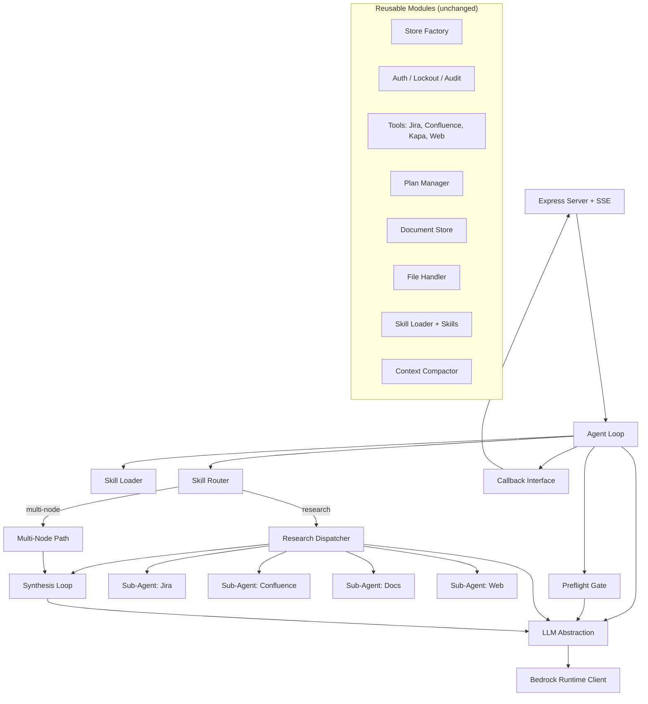

# Design Document: TAM Agent Migration

## Overview

This design covers the migration of the TAM Agent (formerly "Capillary Solution Agent") from Anthropic SDK + LangGraph to AWS Bedrock + a custom async state machine. The migration produces two new core modules — `src/llm.js` (LLM Abstraction Layer) and `src/agentLoop.js` (Custom Agent Loop) — while preserving all existing backend-agnostic modules unchanged.

The architecture follows a layered approach:
1. **LLM Abstraction Layer** — Isolates all Bedrock SDK specifics behind a clean interface (`createMessage`, `streamMessage`)
2. **Custom Agent Loop** — Replaces LangGraph with an explicit async state machine using the same node logic
3. **Reusable Modules** — All persistence, auth, tools, skills, and frontend code copied verbatim

### Design Rationale

- **No framework dependency**: LangGraph adds ~2MB of dependencies for ~200 lines of graph wiring. A custom state machine is simpler to debug and deploy.
- **Provider abstraction**: The `src/llm.js` interface decouples all code from Bedrock specifics, making future provider switches trivial and testing easy (mock the interface).
- **Streaming normalization**: Bedrock's streaming format differs from Anthropic's direct API. A normalization layer yields consistent internal events regardless of provider.

---

## Architecture



### Data Flow

1. HTTP request arrives at Express server
2. Server creates SSE connection and builds callback object
3. `runAgentLoop(state, callbacks)` is invoked
4. Preflight classifies intent (parallel with persona detection)
5. Skills loaded based on classification
6. Router decides execution path
7. Research or multi-node path executes
8. Synthesis loop streams final response via callbacks
9. Callbacks emit SSE events to client

---

## Components and Interfaces

### 1. LLM Abstraction Layer (`src/llm.js`)

```javascript
/**
 * Non-streaming LLM call via AWS Bedrock.
 * @param {Object} options
 * @param {string} options.model - Model alias ("sonnet" | "haiku") or full Bedrock model ID
 * @param {string|Array} options.system - System prompt (string or content blocks)
 * @param {Array} options.messages - Conversation messages in Anthropic format
 * @param {Array} [options.tools] - Tool definitions (omitted if empty)
 * @param {number} options.maxTokens - Maximum tokens to generate
 * @returns {Promise<NormalizedResponse>}
 */
export async function createMessage({ model, system, messages, tools, maxTokens })

/**
 * Streaming LLM call via AWS Bedrock.
 * Returns an async iterable yielding normalized stream events.
 * @param {Object} options - Same as createMessage
 * @returns {AsyncIterable<StreamEvent>}
 */
export async function* streamMessage({ model, system, messages, tools, maxTokens })
```

**Internal helpers:**
- `resolveModelId(alias)` — Maps "sonnet"/"haiku" to env var values, passes through full IDs
- `buildBedrockRequestBody(params)` — Constructs the Bedrock request envelope
- `normalizeResponse(bedrockResponse)` — Transforms Bedrock response to internal format
- `normalizeStreamEvent(bedrockEvent, accumulator)` — Transforms individual stream events

### 2. Custom Agent Loop (`src/agentLoop.js`)

```javascript
/**
 * Main orchestration entry point. Replaces LangGraph StateGraph.
 * @param {AgentState} state - Current agent state
 * @param {CallbackInterface} callbacks - SSE event emitters
 * @returns {Promise<AgentState>} - Final state after execution
 */
export async function runAgentLoop(state, callbacks)
```

**Internal nodes (private functions):**
- `preflightNode(state)` — Single Haiku call for intent classification
- `loadSkillsNode(state, callbacks)` — Conditional skill loading based on preflight result
- `skillRouterNode(state)` — Determines execution mode ("multi-node" or "research")
- `multiNodePath(state, callbacks)` — Skill-driven execution
- `parallelResearchNode(state, callbacks)` — Dispatches domain sub-agents
- `sequentialResearchFallback(state, callbacks)` — Fallback when parallel fails
- `synthesisLoop(state, callbacks)` — Multi-turn streaming with tool use

### 3. Callback Interface

```javascript
/**
 * @typedef {Object} CallbackInterface
 * @property {(text: string) => void} onToken - Text delta from LLM stream
 * @property {(status: string) => void} onStatus - Status message
 * @property {(phase: string) => void} onPhase - Phase transition notification
 * @property {(toolName: string, status: string) => void} onToolStatus - Tool execution status
 * @property {(skillId: string) => void} onSkillActive - Skill activation notification
 * @property {(plan: object) => void} onPlanUpdate - Plan state change
 * @property {(doc: object) => void} onDocumentReady - Document available for download
 * @property {(error: object) => void} onError - Unrecoverable error
 */
```

### 4. Stream Event Types

```javascript
/**
 * Normalized stream events yielded by streamMessage.
 * @typedef {Object} StreamEvent
 * @property {"text"|"tool_use_start"|"tool_input_delta"|"message_complete"|"error"} type
 * @property {string} [text] - For "text" events
 * @property {string} [id] - For "tool_use_start" events
 * @property {string} [name] - For "tool_use_start" events
 * @property {string} [partialJson] - For "tool_input_delta" events
 * @property {NormalizedResponse} [response] - For "message_complete" events
 * @property {object} [error] - For "error" events
 */
```

### 5. Normalized Response Format

```javascript
/**
 * @typedef {Object} NormalizedResponse
 * @property {"assistant"} role
 * @property {Array<ContentBlock>} content
 * @property {string} stop_reason - "end_turn" | "tool_use" | "max_tokens"
 * @property {{input_tokens: number, output_tokens: number}} usage
 */

/**
 * @typedef {Object} ContentBlock
 * @property {"text"|"tool_use"} type
 * @property {string} [text] - For text blocks
 * @property {string} [id] - For tool_use blocks
 * @property {string} [name] - For tool_use blocks
 * @property {object} [input] - For tool_use blocks
 */
```

---

## Data Models

### Agent State

```javascript
/**
 * @typedef {Object} AgentState
 * @property {string} conversationId
 * @property {Array} messages - Conversation history
 * @property {string} systemPrompt - Base system prompt
 * @property {string} problemText - Current user message
 * @property {boolean} [onTopic] - Preflight classification result
 * @property {string} [intent] - Classified intent
 * @property {Array<string>} [toolTags] - Required tool tags
 * @property {Array<string>} [skillIds] - Required skill IDs
 * @property {string} [executionMode] - "multi-node" | "research"
 * @property {Array} [skills] - Loaded skill definitions
 * @property {object} [researchContext] - Aggregated research results
 * @property {boolean} [fallbackToSequential] - Whether parallel research failed
 * @property {object} [clientPersona] - Detected client persona
 * @property {Array} [availableTools] - Filtered tool definitions
 */
```

### Bedrock Request Envelope

```javascript
// Request body sent to Bedrock InvokeModel / InvokeModelWithResponseStream
{
  anthropic_version: "bedrock-2023-05-31",
  max_tokens: number,
  system: string | Array<{type: "text", text: string}>,
  messages: Array<{role: string, content: string | Array<ContentBlock>}>,
  tools?: Array<{name: string, description: string, input_schema: object}>
}
```

### Bedrock Stream Event Format

```javascript
// Bedrock wraps Anthropic streaming events in a `chunk` envelope:
// { bytes: Uint8Array } → decoded JSON matches Anthropic event format:
// - message_start, content_block_start, content_block_delta, content_block_stop, message_delta, message_stop
```

### Model Alias Resolution

| Alias | Environment Variable | Example Value |
|-------|---------------------|---------------|
| `"sonnet"` | `BEDROCK_SONNET_MODEL_ID` | `anthropic.claude-sonnet-4-20250514-v1:0` |
| `"haiku"` | `BEDROCK_HAIKU_MODEL_ID` | `anthropic.claude-haiku-4-5-20251001-v1:0` |

Any string not matching a known alias is passed through as a literal model ID.

---

## Correctness Properties

*A property is a characteristic or behavior that should hold true across all valid executions of a system — essentially, a formal statement about what the system should do. Properties serve as the bridge between human-readable specifications and machine-verifiable correctness guarantees.*

### Property 1: Response Normalization Structure

*For any* valid Bedrock response (containing any combination of text blocks and tool_use blocks), the normalized output SHALL always have the structure `{ role: "assistant", content: Array<ContentBlock>, stop_reason: string, usage: { input_tokens: number, output_tokens: number } }` where each content block is either `{ type: "text", text: string }` or `{ type: "tool_use", id: string, name: string, input: object }`.

**Validates: Requirements 1.3, 11.1, 11.2, 11.3**

### Property 2: Response Serialization Round-Trip

*For any* valid normalized response object, serializing it to JSON and parsing it back SHALL produce a deeply equal object.

**Validates: Requirements 11.4**

### Property 3: Error Response Normalization

*For any* Bedrock error response, the thrown error SHALL always contain an `errorType` (string), `message` (string), and `statusCode` (number).

**Validates: Requirements 1.6**

### Property 4: Tool Definition Formatting

*For any* non-empty array of tool definitions with valid `name`, `description`, and `input_schema` fields, the formatted output SHALL produce an array where each element matches the Anthropic Messages API tool format structure.

**Validates: Requirements 1.7**

### Property 5: Stream Event Normalization

*For any* valid Bedrock stream event sequence, each `text_delta` event SHALL yield a normalized event with `type: "text"` and matching text content, each `tool_use` content_block_start SHALL yield `type: "tool_use_start"` with correct id and name, and each `input_json_delta` SHALL yield `type: "tool_input_delta"` with the partial JSON string.

**Validates: Requirements 2.4, 2.5, 2.6**

### Property 6: Stream Message Assembly

*For any* complete sequence of Bedrock stream events ending with `message_stop`, the final `message_complete` event SHALL contain a correctly assembled response with all accumulated content blocks, the correct stop_reason, and usage statistics.

**Validates: Requirements 2.7**

### Property 7: Stream Error Termination

*For any* error occurring during Bedrock stream processing, the stream SHALL yield exactly one event with `type: "error"` containing error details, and then terminate the async iterable.

**Validates: Requirements 2.8**

### Property 8: Agent Loop Execution Order

*For any* valid agent state where the query is on-topic, the Agent_Loop SHALL execute nodes in the order: Preflight → Skill Loading → Skill Router → (multi-node OR research path), as verified by callback invocation sequence.

**Validates: Requirements 4.2**

### Property 9: Off-Topic Early Termination

*For any* agent state where the Preflight_Gate classifies the query as off-topic (`onTopic: false`), the Agent_Loop SHALL invoke the refusal path and SHALL NOT invoke research dispatch or synthesis nodes.

**Validates: Requirements 4.3, 5.3**

### Property 10: Skill Router Correctness

*For any* agent state after preflight, when the Skill_Router returns `executionMode: "multi-node"` the multi-node path SHALL execute, and when it returns `executionMode: "research"` the Research_Dispatcher SHALL execute.

**Validates: Requirements 4.4, 4.5**

### Property 11: Research Fault Tolerance

*For any* set of dispatched research sub-agents where at least one fails or times out, the Research_Dispatcher SHALL still collect results from all successful sub-agents and SHALL invoke `callbacks.onPhase` upon completion.

**Validates: Requirements 6.3, 6.4, 6.5**

### Property 12: Parallel Research Fallback

*For any* scenario where parallel research returns insufficient results (all sub-agents fail), the Agent_Loop SHALL fall back to sequential research mode.

**Validates: Requirements 4.6**

### Property 13: Synthesis Loop Tool Handling

*For any* tool_use block completed during synthesis streaming, the Synthesis_Loop SHALL execute the tool handler, append the result to messages, and invoke `callbacks.onToolStatus` with the tool name and execution status.

**Validates: Requirements 7.3, 7.4**

### Property 14: Synthesis Loop Termination

*For any* synthesis loop execution, when `stop_reason` is `"tool_use"` the loop SHALL re-invoke the LLM with tool results appended, and when `stop_reason` is `"end_turn"` the loop SHALL finalize and invoke `callbacks.onComplete`. The loop SHALL always terminate within the configured maximum iteration limit.

**Validates: Requirements 7.5, 7.6, 7.7**

### Property 15: Preflight Output Structure

*For any* valid LLM response to the preflight prompt, the parsed Preflight_Gate result SHALL always contain `onTopic` (boolean), `intent` (string), `toolTags` (array), and `skillIds` (array).

**Validates: Requirements 5.2**

### Property 16: Context Compaction Trigger

*For any* conversation where the estimated token count exceeds the configured threshold, the Context_Compactor SHALL invoke summarization, and for conversations below the threshold, it SHALL NOT invoke summarization. In both cases, the full conversation history SHALL be preserved in the database.

**Validates: Requirements 9.1, 9.2**

### Property 17: Phase Transition Callbacks

*For any* complete Agent_Loop execution, `callbacks.onPhase` SHALL be invoked at each major phase transition (preflight, research/multi-node, synthesis) with the correct phase name.

**Validates: Requirements 8.2**

### Property 18: Unrecoverable Error Handling

*For any* unrecoverable error during Agent_Loop execution, `callbacks.onError` SHALL be invoked with error details and execution SHALL terminate gracefully (no further node execution).

**Validates: Requirements 8.4**

---

## Error Handling

### LLM Abstraction Errors

| Error Source | Handling Strategy |
|---|---|
| Missing AWS credentials | Throw `AuthenticationError` with descriptive message at client initialization |
| Bedrock API error (4xx/5xx) | Throw `LLMError` with `{ errorType, message, statusCode }` |
| Network timeout | Throw `LLMError` with type `"network_error"` |
| Stream interruption | Yield `{ type: "error", error: details }` then terminate iterable |
| Invalid model alias | Throw `ConfigurationError` if env var is not set |
| Malformed response | Throw `LLMError` with type `"parse_error"` |

### Agent Loop Errors

| Error Source | Handling Strategy |
|---|---|
| Preflight LLM failure | Invoke `callbacks.onError`, terminate |
| Preflight parse failure | Treat as on-topic (fail-open), log warning |
| Research sub-agent timeout | Log, continue with other results |
| All research sub-agents fail | Fall back to sequential mode |
| Sequential research also fails | Proceed to synthesis with empty context, log warning |
| Synthesis stream error | Invoke `callbacks.onError`, terminate |
| Tool execution error | Append error result to messages, continue synthesis loop |
| Max iteration exceeded | Finalize with partial response, invoke `callbacks.onStatus` with warning |

### Error Propagation

- LLM-level errors bubble up as exceptions to the calling node
- Node-level errors are caught by the Agent Loop orchestrator
- The orchestrator invokes `callbacks.onError` for unrecoverable errors
- Recoverable errors (sub-agent failures, tool errors) are handled locally and logged

---

## Testing Strategy

### Unit Tests

Unit tests cover specific examples, edge cases, and integration points:

- **LLM Abstraction**: Model alias resolution, empty tools omission, request body construction
- **Stream Parser**: Individual event type handling, partial JSON accumulation, edge cases (empty streams, single-event streams)
- **Agent Loop**: Specific routing scenarios, callback invocation order
- **Preflight**: Parse various LLM response formats (JSON in text, structured output)
- **Research Dispatcher**: Timeout handling, empty results, mixed success/failure

### Property-Based Tests

Property-based tests verify universal correctness properties using [fast-check](https://github.com/dubzzz/fast-check) (JavaScript PBT library).

**Configuration:**
- Minimum 100 iterations per property test
- Each test tagged with: `Feature: tam-agent-migration, Property {N}: {title}`

**Properties to implement:**
1. Response normalization structure (Property 1)
2. Response serialization round-trip (Property 2)
3. Error response normalization (Property 3)
4. Tool definition formatting (Property 4)
5. Stream event normalization (Property 5)
6. Stream message assembly (Property 6)
7. Stream error termination (Property 7)
8. Agent loop execution order (Property 8)
9. Off-topic early termination (Property 9)
10. Skill router correctness (Property 10)
11. Research fault tolerance (Property 11)
12. Parallel research fallback (Property 12)
13. Synthesis loop tool handling (Property 13)
14. Synthesis loop termination (Property 14)
15. Preflight output structure (Property 15)
16. Context compaction trigger (Property 16)
17. Phase transition callbacks (Property 17)
18. Unrecoverable error handling (Property 18)

### Integration Tests

- Bedrock API connectivity (with real credentials in CI)
- End-to-end agent loop with mocked LLM responses
- SSE streaming from Express server to client
- MongoDB store operations (existing tests, unchanged)

### Test Organization

```
src/__tests__/
├── llm.test.js              — Unit + property tests for LLM abstraction
├── llm.stream.test.js       — Unit + property tests for streaming
├── agentLoop.test.js        — Unit + property tests for state machine
├── preflight.test.js        — Unit + property tests for preflight gate
├── researchDispatcher.test.js — Unit + property tests for research
├── synthesisLoop.test.js    — Unit + property tests for synthesis
├── compaction.test.js       — Unit + property tests for context compaction
└── integration/
    ├── bedrock.integration.test.js
    └── agentLoop.integration.test.js
```

### Generators (for fast-check)

Key generators needed:
- `arbBedrockResponse()` — Random valid Bedrock response envelopes
- `arbContentBlock()` — Random text or tool_use content blocks
- `arbStreamEventSequence()` — Valid sequences of Bedrock stream events
- `arbBedrockError()` — Random Bedrock error responses
- `arbToolDefinition()` — Random tool definitions with valid schemas
- `arbAgentState()` — Random valid agent states
- `arbPreflightResult()` — Random preflight classification results
- `arbResearchResults()` — Random sub-agent results (mix of success/failure)
