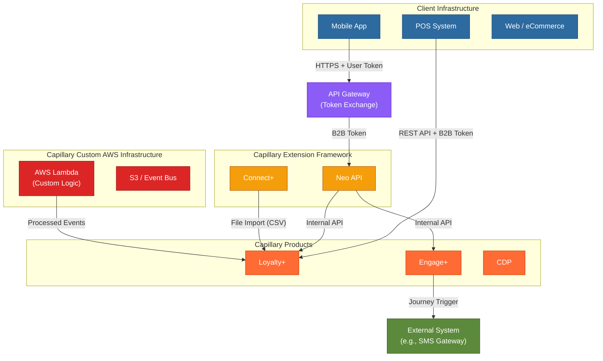
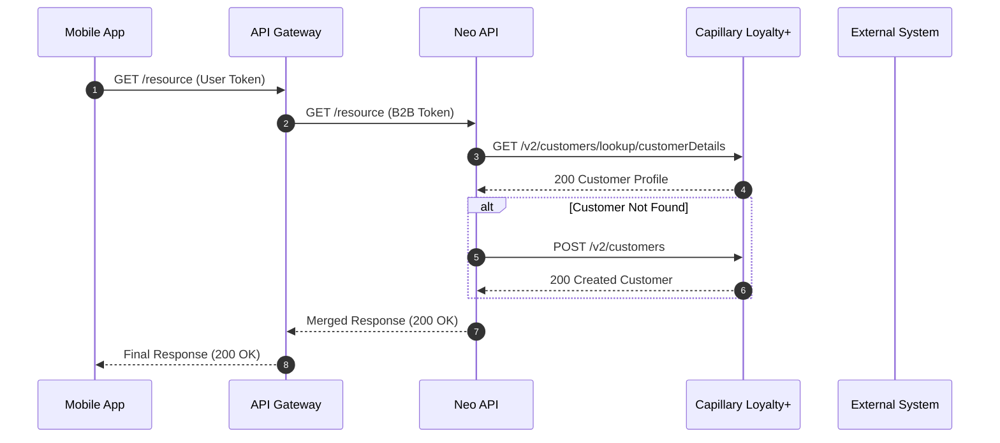
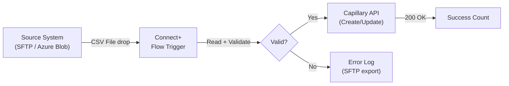
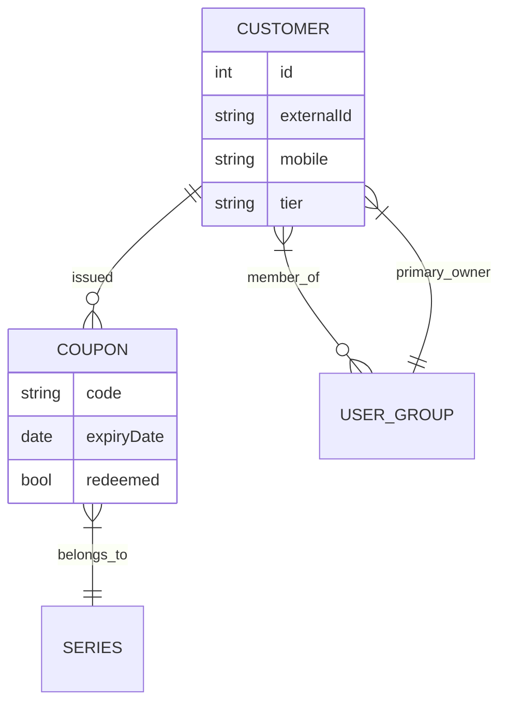

# Mermaid.js Diagram Rules

ALL diagrams MUST be Mermaid.js code blocks. Never describe a diagram in prose alone. Never say "see attached diagram."

---

## Color Class Definitions (apply to every architecture diagram)

```
classDef capillary  fill:#FF6B35,stroke:#CC4400,color:#fff
classDef extension  fill:#F59E0B,stroke:#B45309,color:#fff
classDef customaws  fill:#DC2626,stroke:#991B1B,color:#fff
classDef client     fill:#2D6A9F,stroke:#1A4F7A,color:#fff
classDef external   fill:#5C8A3C,stroke:#3D5E28,color:#fff
classDef gateway    fill:#8B5CF6,stroke:#6D28D9,color:#fff
```

- **capillary** (orange) — Capillary SaaS products: Loyalty+, Engage+, Insights+, CDP
- **extension** (amber) — Capillary Extension Framework: Neo API, Connect+
- **customaws** (red) — Capillary Custom AWS Infrastructure: Lambda, S3, SQS, EventBridge, RDS, custom services built and operated by Capillary for this client
- **client** (blue) — client-owned systems: POS, mobile app, web, ecommerce, CRM, client-managed cloud infra
- **external** (green) — third-party systems: SMS gateway, identity provider, payment gateway, partner systems
- **gateway** (purple) — API Gateway / API Manager (token exchange layer)

---

## Architecture Diagram

Use `flowchart TD` (top-down) for complex multi-system views, `flowchart LR` (left-right) for simpler linear flows.

Rules:
- Every system in Section 4 must appear
- Every arrow must be labeled with protocol, data type, or action name
- Show API Gateway explicitly when UI clients are involved
- Rounded rectangle nodes: `NodeName["Label\n(detail)"]`
- **Network boundaries are mandatory subgraphs** — always use all four zones below; omit a zone only if the solution uses zero systems in it:

| Subgraph label | Contains | Node class |
|----------------|----------|------------|
| `Client Infrastructure` | Mobile app, web, POS, CRM, client cloud infra | `:::client` |
| `Capillary Products` | Loyalty+, Engage+, CDP, Insights+ | `:::capillary` |
| `Capillary Extension Framework` | Neo API, Connect+ | `:::extension` |
| `Capillary Custom AWS Infrastructure` | Lambda, S3, SQS, EventBridge, RDS, custom services | `:::customaws` |

API Gateway and external third-party systems sit **outside** all subgraphs (they are boundary nodes, not zone members).

**Template:**


---

## Sequence Diagram

Rules:
- **Always** use `autonumber` directive
- Participant format: `participant Short as Full Name`
- `->>` for synchronous calls, `-->>` for responses
- `alt` blocks for conditional branches: `alt Customer Found ... else Customer Not Found`
- `note over` for clarifying annotations
- API Gateway must be an explicit participant when calling system is mobile/web
- Step count in diagram must match numbered Process Flow list

**Template:**


---

## Data Flow Diagram

Use `flowchart LR` for file/event pipelines.

Rules:
- Show data transformations as intermediate nodes
- Error paths as separate branches
- Label file formats and protocols on all arrows

**Template:**


---

## ER Diagram

Rules:
- Standard Mermaid ER notation
- Cardinality on ALL relationships: `||`, `|{`, `}|`, `}o`, `o|`
- Include only entities and attributes relevant to the current use case

**Template:**


---

## Excalidraw Routing

> When `EXCALIDRAW_AVAILABLE: true` (set in Step 0.7), certain diagram types route to Excalidraw. Mermaid remains the baseline for all diagrams.

### Routing Table

| Diagram Type | SDD Location | Primary Tool | Fallback | Rationale |
|-------------|-------------|-------------|----------|-----------|
| Architecture overview | §6 Deployment View | Excalidraw | Mermaid `flowchart TD` | Spatial layouts with zones, color-coded systems, and labeled connections benefit from Excalidraw's free-form positioning |
| Sequence diagram | §9 element D | Mermaid | — (no fallback needed) | Mermaid sequence diagrams are compact, inline-renderable, and well-understood by developers. `autonumber` and `alt`/`opt` blocks work well |
| Data flow diagram | §9 element G | Excalidraw | Mermaid `flowchart LR` | Pipeline flows with transformations, error branches, and file format annotations are more readable with Excalidraw's spatial layout |
| ER diagram | §9 element H | Mermaid | — | Mermaid ER notation with cardinality is concise and sufficient |
| Simple flowchart (<10 nodes) | Various | Mermaid | — | Simple decision trees and flows render well in Mermaid |
| Complex flowchart (≥10 nodes) | Various | Excalidraw | Mermaid `flowchart TD` | Dense flowcharts get unreadable in Mermaid; Excalidraw handles spatial layout better |
| Context diagram | §3 Context/Scope | Excalidraw | Mermaid `flowchart TD` | System boundary diagrams with inside/outside zones benefit from spatial layout |

### Availability & Fallback

Availability is checked in Step 0.7 (Glob for `.claude/skills/excalidraw-diagram/SKILL.md`). When `EXCALIDRAW_AVAILABLE: false`: all diagrams use Mermaid (no change). When `true`: route per the table above; include a Mermaid fallback code block below each Excalidraw image.

### Excalidraw Generation Flow

For each diagram routed to Excalidraw:

1. **Design specification:** Write a clear specification for the diagram — what systems, connections, labels, and zones to show. Include the data from the SDD sections already written.
2. **Invoke Excalidraw skill:** Generate the `.excalidraw` JSON following the excalidraw-diagram skill's methodology:
   - Map concepts to visual patterns (fan-out, convergence, timeline, etc.)
   - Apply Capillary color mapping (see Color Mapping below)
   - Section-by-section generation for large diagrams
3. **Render:** Use the excalidraw-diagram skill's render pipeline (`render_excalidraw.py`) to produce PNG.
4. **Save:** Store outputs in `output-sdd/{BrandName}-diagrams/`:
   - `{diagram-name}.excalidraw` — editable source
   - `{diagram-name}.png` — rendered image
5. **Embed in SDD** (see Embedding Pattern below).

### Mermaid → Excalidraw Color Mapping

| Mermaid Class | Semantic | Excalidraw Fill | Excalidraw Stroke |
|--------------|----------|----------------|-------------------|
| `capillary` | Capillary Products (Loyalty+, Engage+, CDP, Insights+) | `#fed7aa` (warm orange) | `#c2410c` |
| `extension` | Extension Framework (Neo, Connect+) | `#fef08a` (amber) | `#a16207` |
| `customaws` | Custom AWS Infrastructure (Lambda, S3) | `#fecaca` (light red) | `#b91c1c` |
| `client` | Client Systems (POS, mobile, web, CRM) | `#bfdbfe` (light blue) | `#1e3a5f` |
| `external` | External Systems (SMS, payment, partners) | `#a7f3d0` (light green) | `#047857` |
| `gateway` | API Gateway | `#ddd6fe` (light purple) | `#6d28d9` |

These colors align with the excalidraw-diagram skill's `color-palette.md` semantic categories.

### Embedding Pattern

**When Excalidraw diagram is available:**

```markdown
### 6.1 Architecture Overview


*[Open in Excalidraw](./PidiliteHumsafar-diagrams/architecture-overview.excalidraw) for editing*

<details>
<summary>Mermaid fallback (for environments without image support)</summary>

\`\`\`mermaid
flowchart TD
    %% Mermaid equivalent of the Excalidraw diagram above
    ...
\`\`\`

</details>
```

When only Mermaid is available: use standard Mermaid code blocks (no change from baseline).

### Zone Mapping for Architecture Diagrams

Both Excalidraw and Mermaid must use the mandatory zones defined in the Architecture Diagram section above. Excalidraw renders each zone as a rectangle region with the corresponding color fill (e.g., `client` fill for Client Infrastructure, `capillary` fill for Capillary Products). Omit a zone only if it has zero systems for this SDD.
